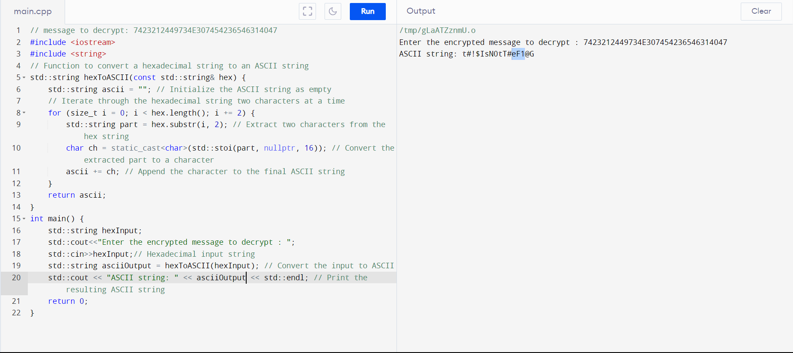
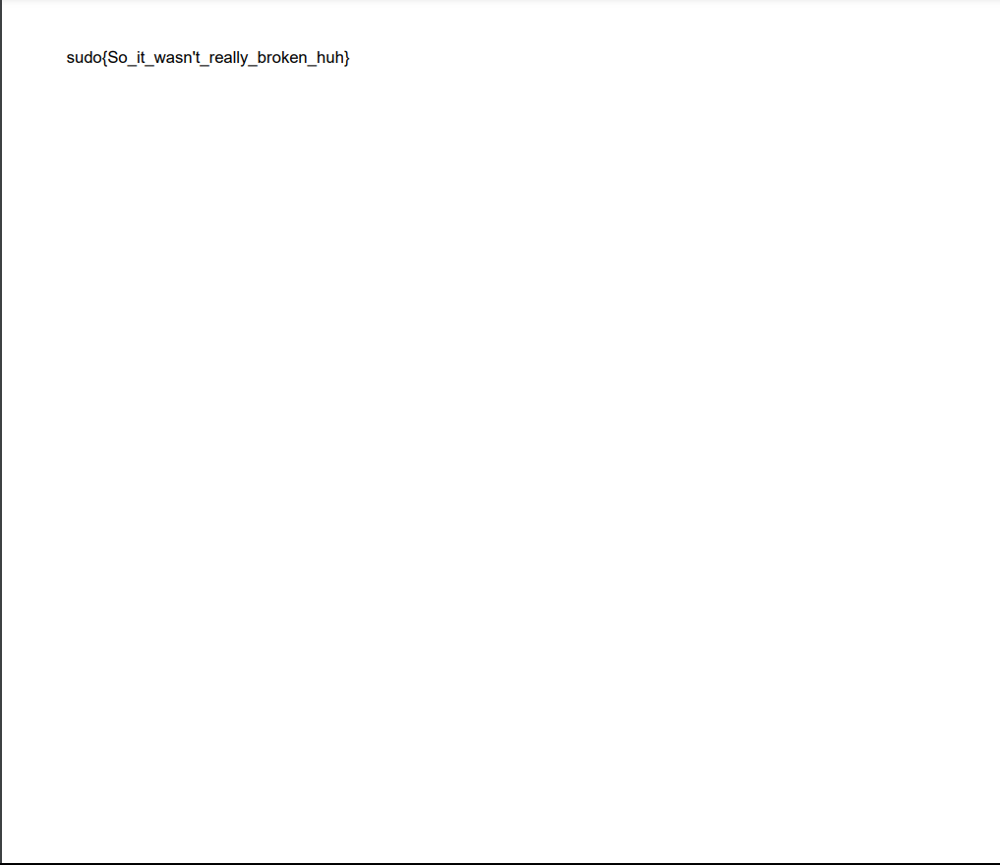
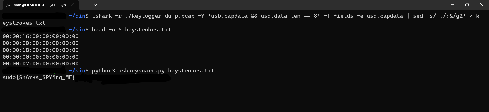

# Broken!!!

Here we have a decrytor, but its broken for some reason Decryptor.cpp. And here we have a key somewhere in this file : key.txt, but where to use it?

### File: Decryptor.cpp, key.txt

## Solution:
 
1. key.txt is a compressed file, which consists of a locked zip file containing random.pdf.
2. The code provided is used to convert hex to ascii, but it doesnt work since in the main function, "br0kEn" was hardcoded to be output. Corrected the output statement to print the variable asciiOutput instead of the string literal "brOkEn".
3. Using the first 32 characters of the key.txt file to get hex data (7423212449734E307454236546314047).
4. Hex data is used as input for Decryptor.cpp, which gives output (t#!$IsN0tT#eF1@G)

 

5. Using `t#!$IsN0tT#eF1@G` as the password, to open random.pdf.

 

## Flag: sudo{So_it_wasn't_really_broken_huh}

---

# Niagara in MSB!!!

The image manages to slip past the LSB statistical check, but those funky visual quirks have us thinking there's more to it. The image is here!

### File: Niagara_in_MSB.png

## Solution:
 
1. Use sigBits to extract data using MSB `python3 sigbits.py -t=MSB Niagara_in_MSB.png`
2. Search for flag inside the extracted output data. `grep -o 'sudo{[^}]*}' outputSB.txt`
3. Using `t#!$IsN0tT#eF1@G` as the password, to open random.pdf.

 

## Flag: sudo{the_Niagara_falls!!!}

---

# SpyShark

I have discovered a suspicious pcap file in my trash folder. I suspect that it is a log dump of one of my usb devices and might also contain some confidential data. To successfully complete this challenge, you'll need to employ your forensic skills and unravel the secrets hidden in the pcap file.

Hint: The USB Device turns out to be a Keyboard

### File: keylogger_dump.pcap

## Solution:

1. tshark to strip out only the keyscans `tshark -r ./keylogger_dump.pcap -Y 'usb.capdata && usb.data_len == 8' -T fields -e usb.capdata | sed 's/../:&/g2' > keystrokes.txt`
2. Use the tool [ctf-usb-keyboard-parser](https://github.com/carlospolop-forks/ctf-usb-keyboard-parser) to get what was written in the communication `python3 usbkeyboard.py keystrokes.txt`

 

## Flag: sudo{ShArKs_SPYing_ME}

---

# The Old Guitarist

It's so depressing to listen to this masterpiece of Picasso.

### File: Old_guitarist_chicago.jpg

## Solution:

1. Binwalk shows there is embedded files, extracting it using binwalk.
2. Extracted files contain chords.wav.
3. Flag is visible, using Spectogram in audacity

 

### Flag: sudo{th3_b1u3_p37i0d}
