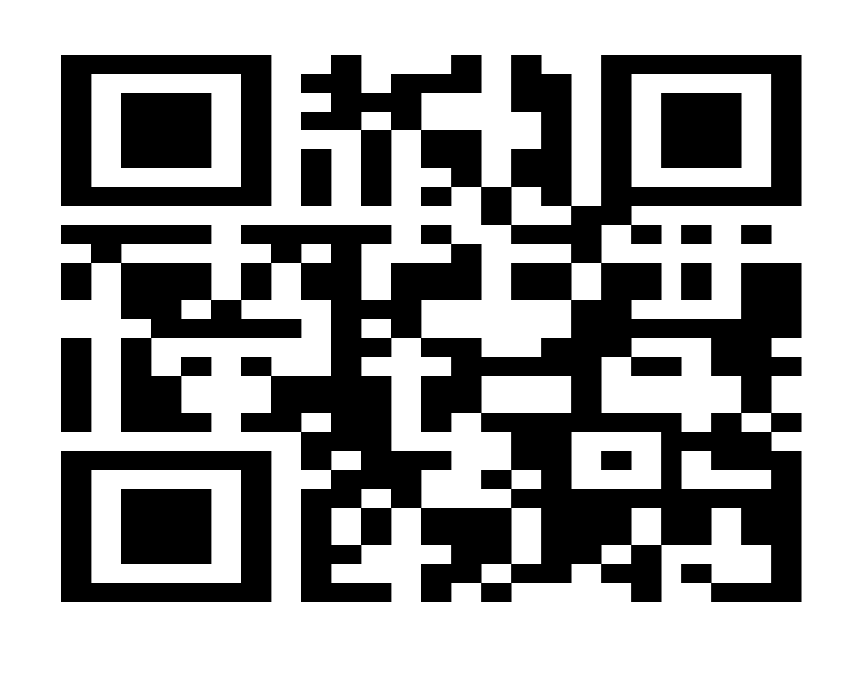

# It's all "@"

### File: confusing.txt

## Solution:

It looks like a QR code, but the QR format is wrong. Text editors are not able to render the characters correctly.

1. Open the file in terminal, the QR looks fine.

3. Editing confusing.txt according to the output in the terminal
4. Replacing "@" with "█"

6. Parsing QR gives the flag

### Flag: sudo{a5c11_roCk5}

