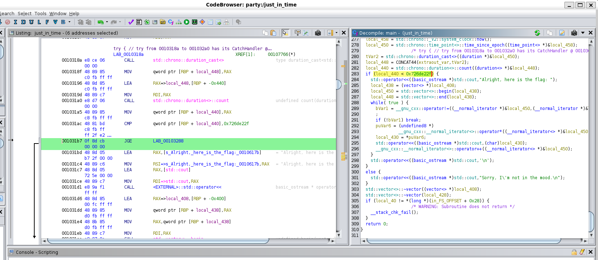
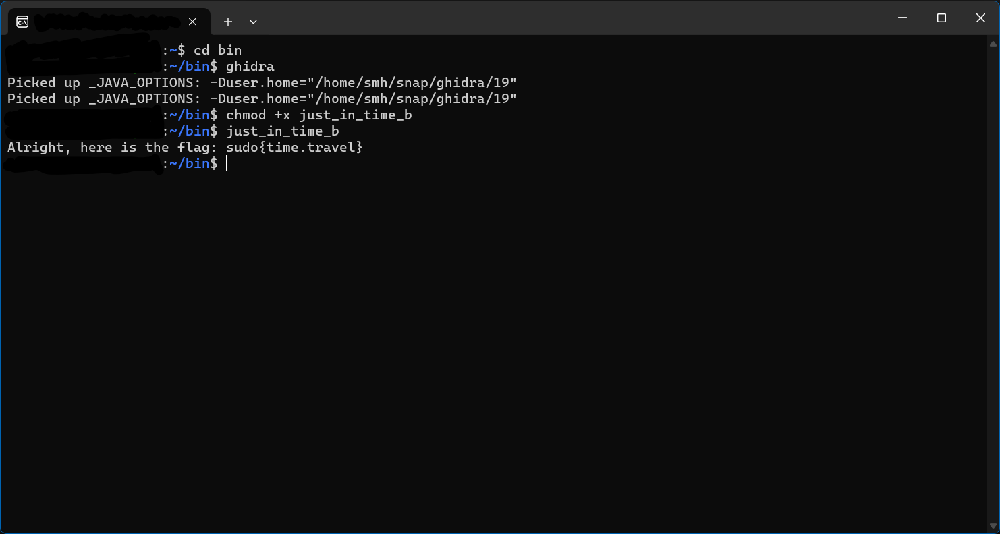

# Just in Time

Sometimes, a little patience is all you need.

## Solution

1. The flag is printed if local_440 is greater or equal to condition, so changing it to if local_440 is lesser than or equal.
  

3. changing JLE to JGE in assembly will print the flag

## Flag: sudo{time.travel}
