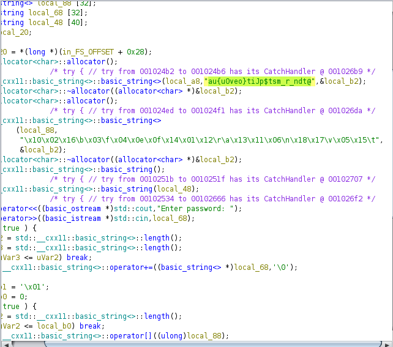

# Match The Following

### File: rev001

## Solution:

1. Analysing strings gives two strings which are relevant. One contains scrambled flag and another contains correct index of each character in hex.

## Flag: sudo{Ju$t_a_permvt@ti0n}
