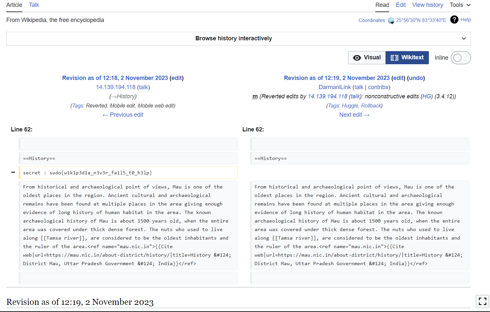

# The Secret

One of my friend Devansh told me about his town Maunath Bhanjan and a secret hidden in the toWn's history. He told that only the smartest geeks can uncover the secret of the town. One just needs to vIew the history of the history of the town to Know the hIdden secret.

## Solution:

1. Combining capital letters in the middle of the word gives WIKI.
2. [Maunath Bhanjan on Wikipedia](https://en.wikipedia.org/wiki/Mau,_Uttar_Pradesh) 
3. Check View history and opening the difference of edit from user DarmaniLink with the [previous revision](https://en.wikipedia.org/w/index.php?title=Mau,_Uttar_Pradesh&diff=prev&oldid=1183138872) gives the text: `secret : sudo{w1k1p3d1a_n3v3r_fa1l5_t0_h3lp}`

## Flag: sudo{w1k1p3d1a_n3v3r_fa1l5_t0_h3lp}