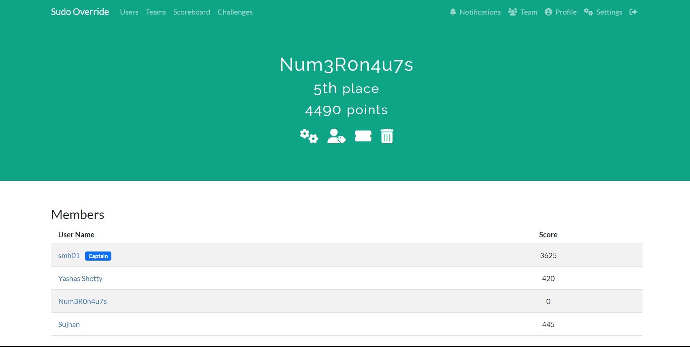

# Sudo Override CTF Writeups

Welcome to the Sudo Override CTF Writeups repository! This repository contains detailed solutions and explanations for challenges from the CTF competition organized by IIT Patna. The challenges cover various categories, including cryptography, miscellaneous, forensics, OSINT, reverse engineering, programming, and web.

## Team Information

I, smh01, participated in the Sudo Override CTF as a member of the team **Num3R0n4u7s**. Our team finished 5th with a total of 4490 points. Congratulations to all team members for their efforts and achievements!
<p align="center">
  
</p>


## Table of Contents

- [Introduction](#introduction)
- [Challenge Categories](#challenge-categories)
- [Folder Structure](#folder-structure)
- [Writeup Format](#writeup-format)

## Introduction

This repository serves as a comprehensive resource for understanding and solving challenges presented in the Sudo Override CTF. Whether you're a participant looking for solutions or a cybersecurity enthusiast eager to learn, you'll find valuable insights here.

## Challenge Categories

- **Cryptography**
- **Miscellaneous**
- **Forensics**
- **OSINT (Open-Source Intelligence)**
- **Reverse Engineering**
- **Programming**
- **Web**

Each category is represented by a dedicated folder in the repository.

## Folder Structure

The repository is organized by challenge categories, and each category contains its respective challenges. The folder structure is as follows:

```
├── cryptography
│ ├── challenge1
│ ├── challenge2
│ └── ...
├── miscellaneous
│ ├── challenge1
│ ├── challenge2
│ └── ...
├── forensics
│ ├── challenge1
│ ├── challenge2
│ └── ...
├── osint
│ ├── challenge1
│ ├── challenge2
│ └── ...
├── reverse_engineering
│ ├── challenge1
│ ├── challenge2
│ └── ...
├── programming
│ ├── challenge1
│ ├── challenge2
│ └── ...
└── web
├── challenge1
├── challenge2
└── ...
```
## Writeup Format

Each challenge folder contains a detailed writeup explaining the solution and steps to solve the challenge. The writeup follows a standardized format, including:

- Challenge description
- Initial analysis
- Solution steps
- Code snippets (if applicable)

Feel free to contribute your writeups and improvements!
