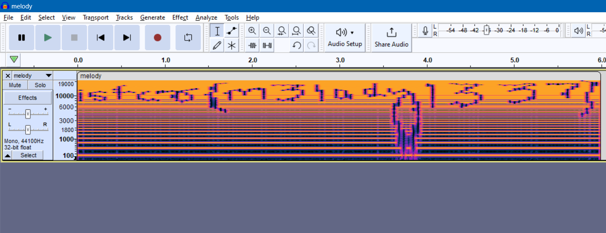
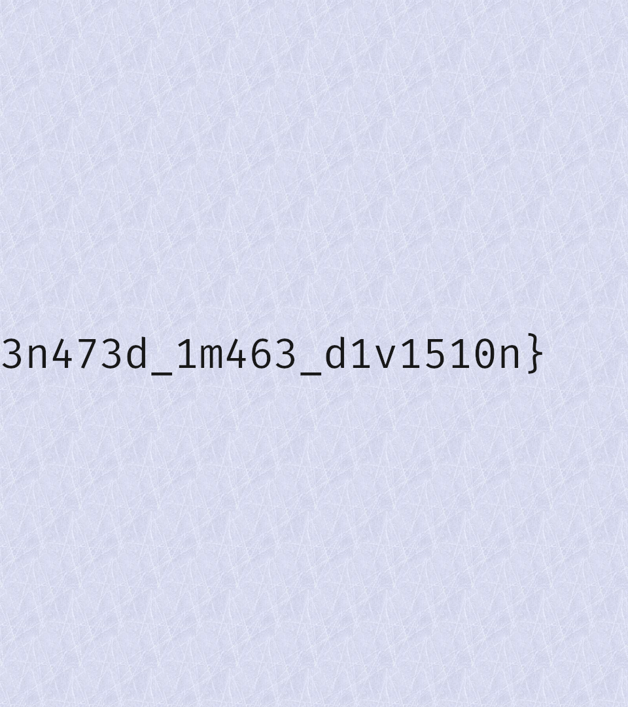
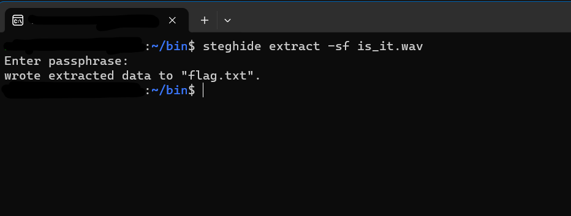
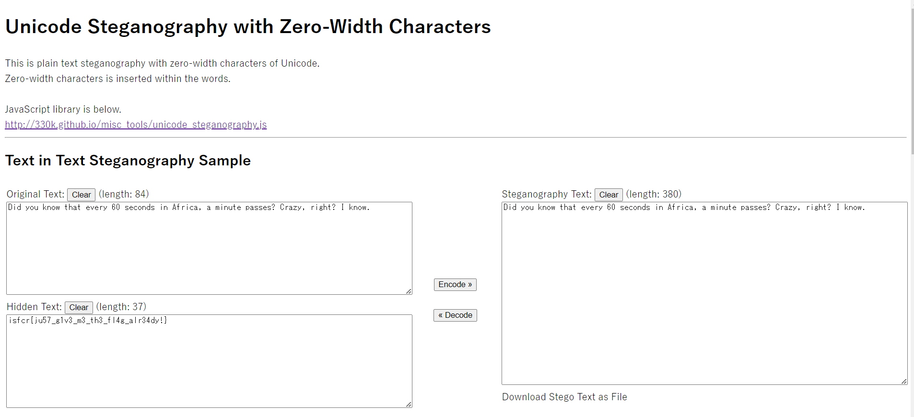

# beep-boop-beep-boop

NASA used this to transmit images of the far side of the Moon, we use it to hide useless flags :)

Hints Is this file audio or can you see something else SSTV encoded, download robots36 on your phone.

### Files: beep-boop.wav

## Solution: 

1. `$ sstv -d beep-boop.wav -o result.png`

## Flag: isfcr{sup3r_s3cr3t_t3l3v1510n}

---

# Corrupted

Apparently the flag I received this file from Elliot contains a flag. But the file seems to be corrupted, help me fix it and find the flag! Hints ● Have you tried opening the file in a hex editor? ● Read up on file signatures for image files. ● Inspect the 1st 4 bytes of the file - D8 FF E0 FF

### Files: chall.jpg

## Solution: 

1. changed header bytes to `FF D8 FF E0`

## Flag: isfcr{h34d3r_c0rr3c710n_f7w}

---

# el-es-bee

My favourite youthuber said they hid a flag in the thumbnail of their latest video. So why can't i find anything :'( ?

Hints ● How do you hide data in images? ● Read up on Least Significant Bit Steganography.

### Files: flag.png

## Solution: 

1. LSB `$ python3 sigBits.py ../flag.png`

## Flag: isfcr{l0k35h_5ur35h_br0k35h}

---

# Jikan

Time is precious and so are you
Hints ● Whats in this image? (Binwalk)

### Files: cats.png

## Solution: 

1. binwalk `$ binwalk -e cats.png`
2. precious folder contains, file `1` with contents
`aXNmY3J7ZmFrZWZsYWd9aXNmY3J7ZmFrZWZsYWd9aXNmY3J7ZmFrZWZsYWd9aXNmY3J7ZmFrZWZsYWd9aXNmY3J7ZmFrZWZsYWd9aXNmY3J7ZmFrZWZsYWd9aXNmY3J7ZmFrZWZsYWd9aXNmY3J7ZmFrZWZsYWd9aXNmY3J7ZmFrZWZsYWd9aXNmY3J7ZmFrZWZsYWd9aXNmY3J7ZmFrZWZsYWd9aXNmY3J7NzFtM180bmRfN2gzX3cxbmR9`
3. decoding from base64 to ascii
`isfcr{fakeflag}isfcr{fakeflag}isfcr{fakeflag}isfcr{fakeflag}isfcr{fakeflag}isfcr{fakeflag}isfcr{fakeflag}isfcr{fakeflag}isfcr{fakeflag}isfcr{fakeflag}isfcr{fakeflag}isfcr{71m3_4nd_7h3_w1nd}`

## Flag: isfcr{71m3_4nd_7h3_w1nd}

---

# my-newer-music

Just another day in Florida - I was kidnapped by Aliens from a planet named Spectogrammon but managed to escape. I have some audio recording from their spaceship but I can't understand what it means. Perhaps they listen to music too? I'm publishing this for y'all to rise to fame.
Hints ● Visualize the audio

### Files: melody.wav

## Solution: 

1. open spectogram using Audacity 

## Flag: isfcr{m3lody1337}

---

# png-split

I found the first half of the flag, but where is the rest???

Hints ● Have you tried running strings on the file? ● Read up on file signatures for image files. ● strings | grep IHDR gives a peculiar output.

### Files: flag.png

## Solution: 

1. We can see 1 half of the flag in the image. `isfcr{3z_2_1n_1_c0nc47` 

2. Using `$strings flag.png | grep IHDR`, gives 2 results, hinting there's another png file hiding at the end of the 1st image.
3. Extracting the 2nd part of the png file using hexedit, gives 2nd half of the image. `3n473d_1m463_d1v1510n}`

## Flag: isfcr{3z_2_1n_1_c0nc473n473d_1m463_d1v1510n}

---

# r33l-life

My friend Mr.Mercury likes to hide secrets in recordings of his songs. I overheard him saying that he uses the same password everywhere too, his favorite British rock band. What a stupid guy
Hints ● Whats hiding in the image?

### Files: is_it.wav

## Solution: 

1. The name Mr.Mercury and British rock band could hint the password to be `queen`
2. Using steghide `$ steghide extract -sf is_it.wav` and entering `queen` as passphrase, flag.txt is extracted. The extracted file contains the flag
3. Extracting the 2nd part of the png file using hexedit, gives 2nd half of the image. `3n473d_1m463_d1v1510n}`

## Flag: isfcr{y35_y35_17-i5}

---

# htdiworez
100
Find the message hidden inside this text file. There is always more than meets the eye. Flag format: isfcr{}

Hints ● zero width https://330k.github.io/misc_tools/unicode_steganography.html

## Solution: 

1. Decode using [Unicode Steganography with Zero-Width Characters](https://330k.github.io/misc_tools/unicode_steganography.html)

## Flag: isfcr{m3lody1337}
